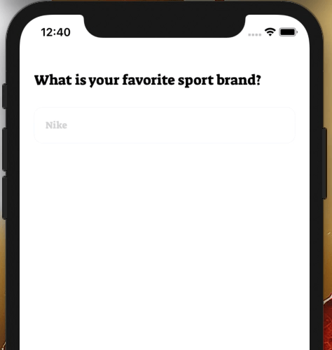
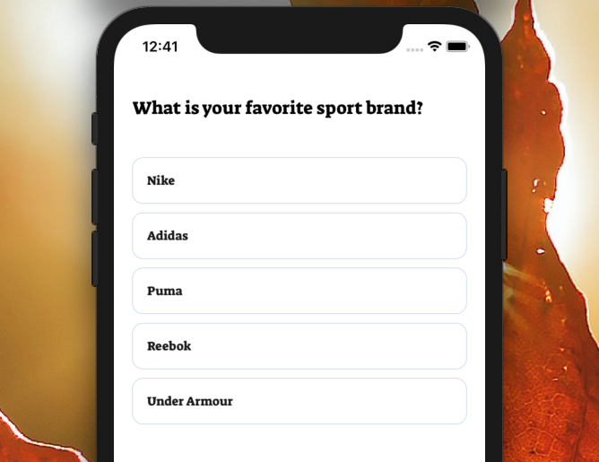

<p align="center">
  
</p>

<table>
  <tr>
    <td>
      <b>React Native Poll</b>
    </td>
    <td>
      <b>React Native Poll Choice Selected</b>
    </td>
  </tr>
 <tr>
    <td align="center"> 
      
    </td>
    <td align="center">
      
    </td>
   </tr>
</table>

# Installation

Add the dependency:

```bash
npm i react-native-poll
```
